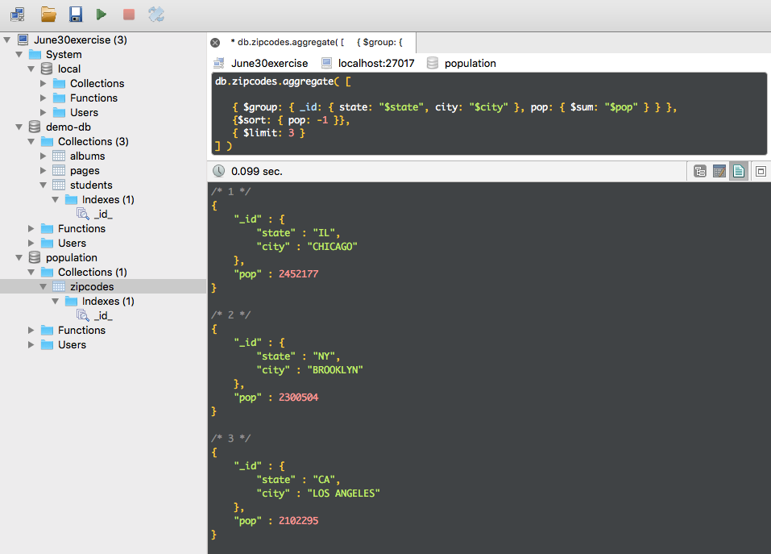

# codingcampExercises
The assignments and exercises I've done for DigitalCraft

# Screenshot

# MongoDB Learning Objectives
* Operators: insert, update remove, upsert, count, find, aggregate, group, match, unwind, sort, 
* How to use Robomongo GUI
